# ESP32-TOOLS-PRO-480x320-V2.0

Multi-tool firmware for ESP32 Dev Module with a 480x320 SPI TFT screen. This V2.0 version adds real support for external IR and CC1101 modules, new WiFi/BLE tools, savable IR capture and replay, sub-GHz RF analysis, and a more polished interface for personal laboratory use.

> Use this firmware only on your networks, your devices, and environments where you have authorization. Several functions can scan, transmit, interfere, or copy signals. The goal of this project is learning, diagnostics, and personal lab use.

[](https://github.com/pepeangell5)
[](https://pepeangell5.github.io/ESP32-TOOLS-PRO-480x320-V2.0/)
[](https://instagram.com/pepeangelll)
[](https://www.facebook.com/esp32tools/)

## Index

- [What changed compared to V1.0](#what-changed-compared-to-v10)
- [Target hardware](#target-hardware)
- [Gallery](#gallery)
- [Firmware screenshots](#firmware-screenshots)
- [Navigation](#navigation)
- [Main features](#main-features)
  - [WiFi Tools](#wifi-tools)
  - [Radio Tools](#radio-tools)
  - [Signal Tools / IR](#signal-tools--ir)
  - [CC1101 Tools](#cc1101-tools)
  - [Bluetooth Tools](#bluetooth-tools)
  - [System Tools](#system-tools)
  - [Web Dashboard](#web-dashboard)
- [Components used](#components-used)
  - [Component images](#component-images)
  - [Complete connection diagrams](#complete-connection-diagrams)
  - [Reference pinouts](#reference-pinouts)
- [Connections table](#connections-table)
  - [Shared SPI bus](#shared-spi-bus)
  - [480x320 TFT Screen](#480x320-tft-screen)
  - [nRF24L01 #1](#nrf24l01-1)
  - [nRF24L01 #2](#nrf24l01-2)
  - [M5Stack IR Unit](#m5stack-ir-unit)
  - [CC1101](#cc1101)
  - [Buttons](#buttons)
- [Visual connection diagram](#visual-connection-diagram)
- [Quick pin map](#quick-pin-map)
- [Web flasher](#web-flasher)
- [Compile and upload with PlatformIO](#compile-and-upload-with-platformio)
- [Known limits](#known-limits)
- [Credits](#credits)
- [Social media and links](#social-media-and-links)

## What changed compared to V1.0

- Support for M5Stack IR Unit with capture, replay, saved signals, and virtual remotes.
- Support for sub-GHz CC1101 module inside `Radio Tools > CC1101`.
- Renewed `Jammer` in `Radio Tools` for 2.4 GHz testing with dual nRF24L01.
- New `BT Jammer` inside `Bluetooth Tools` for educational 2.4 GHz sweeping in personal labs.
- New WiFi tools: Channel Scan, WiFi Radar, and WiFi Direction Finder.
- New BLE Device Radar with RSSI tracking, estimated proximity, and clean details.
- New BLE Inspector to view manufacturer, type, appearance, and services.
- Experimental iPhone Remote/BLE HID for testing with your own devices.
- Updated splash screen with cleaner text animation and `BWifiKill` branding.
- Menus with less flickering, cursor remembered upon return, and clearer diagnostic screens.
- Pin documentation to solder additional hardware without guessing.

[Back to index](#index)

## Target hardware

- Classic ESP32 Dev Module.
- 480x320 SPI TFT Screen with ILI9488 driver.
- 2 nRF24L01 modules for 2.4 GHz tools.
- M5Stack IR Unit with infrared receiver and transmitter.
- CC1101 sub-GHz module.
- 3 physical buttons: UP, OK, and DOWN.
- Wires, solder, headers, and common GND for all modules.

RF433T/RF433R modules are not integrated into this version because the CC1101 handles sub-GHz work better and allows more diagnostics from software.

[Back to index](#index)

## Gallery

| View | Image |
| --- | --- |
| Finished device |  |
| Front view | 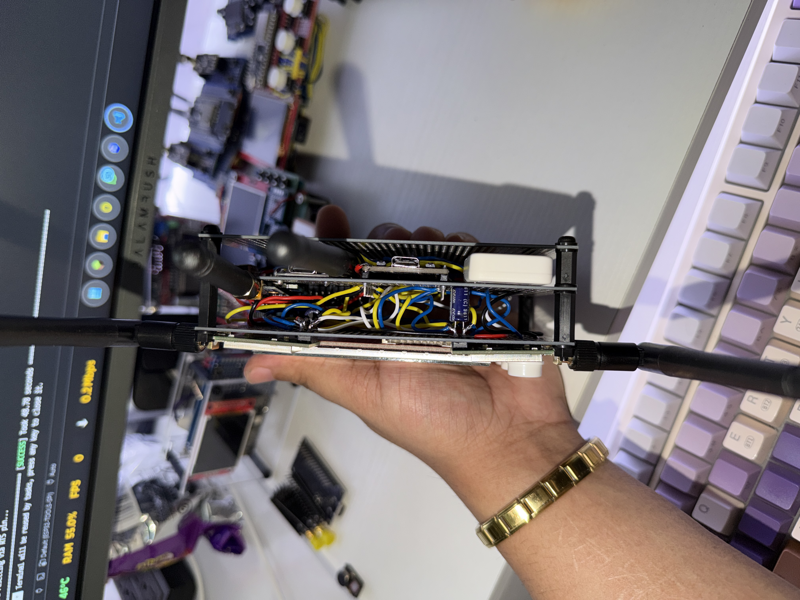 |
| Side view |  |
| Internal view / mounting |  |

[Back to index](#index)

## Firmware screenshots

| Menu | Image |
| --- | --- |
| Splash | 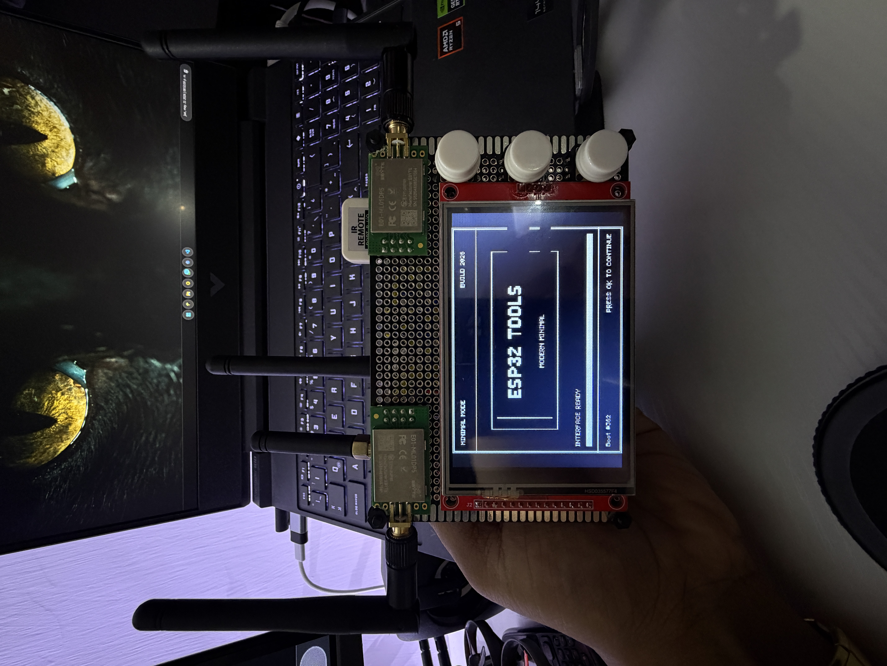 |
| Main Menu | 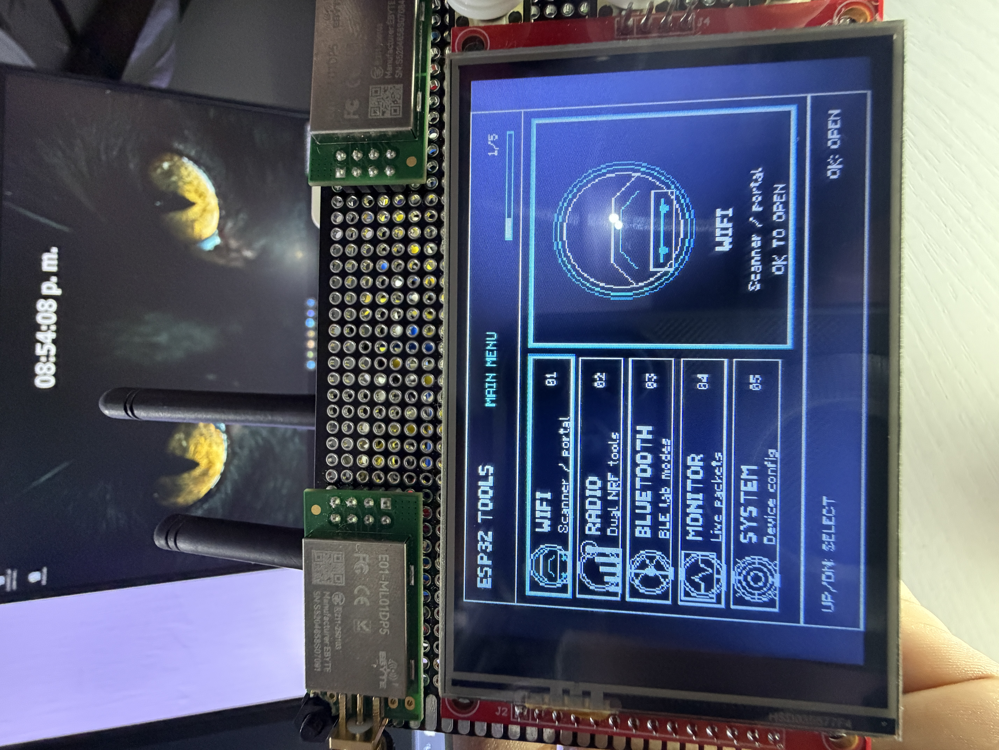 |
| WiFi Tools |  |
| WiFi scanner / channels |  |
| Radio Tools | 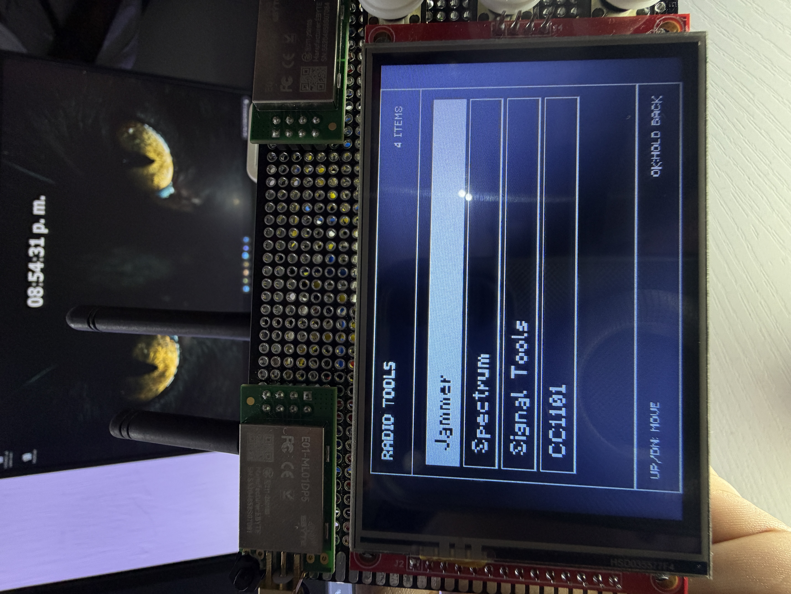 |
| Bluetooth Tools | 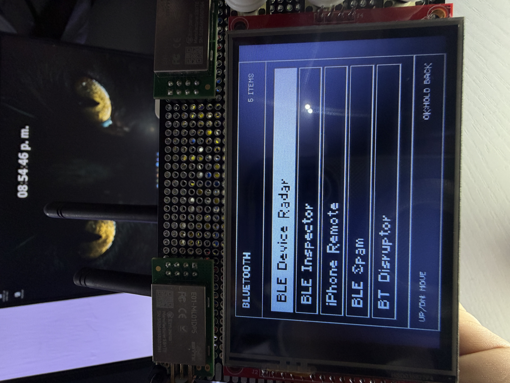 |
| Packet Monitor |  |
| System Tools | 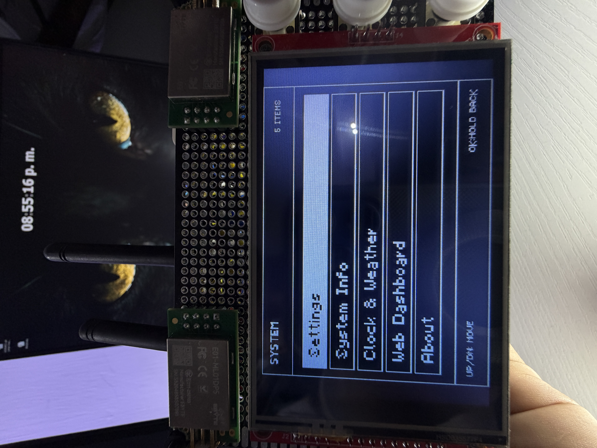 |
| Screensaver |  |

[Back to index](#index)

## Navigation

- `UP`: move up or change value.
- `DOWN`: move down or change value.
- `OK`: enter, select, capture, or execute action.
- Hold `OK`: return, cancel, or exit the current screen.
- Submenus remember the option you were on when returning.

[Back to index](#index)

## Main features

### WiFi Tools

- `WiFi Scanner`: scans nearby 2.4 GHz WiFi networks and displays SSID, BSSID, channel, RSSI, frequency, and security.
- `Channel Scan`: groups networks by channel, shows how many networks are in each channel, and allows opening the AP list per channel.
- `WiFi Radar`: lets you choose an AP and track it by RSSI, proximity percentage, peak, trend, and history.
- `WiFi Direction Finder`: measures RSSI by sectors to estimate from which direction a network arrives strongest.
- `WiFi Config`: connects the ESP32 to a network using a virtual keyboard and saves credentials in NVS.
- `Beacon Spam`: emits test beacons for controlled laboratory use.
- `Deauther`: WiFi testing tool for authorized environments.
- `Evil Portal`: educational captive portal to demonstrate phishing flows in a personal lab.
- `Probe Sniffer`: observes nearby WiFi probes and shows detected activity.
- `KARMA Attack`: educational mode to understand responses to probes and insecure associations.

Important limitation: the classic ESP32 only works with 2.4 GHz WiFi. It cannot scan 5 GHz networks.

### Radio Tools

- `Jammer`: renewed mode for 2.4 GHz testing in a personal lab. Allows choosing WiFi channel, activating/stopping with `OK`, and uses both nRF24L01s when available.
- `Radio Scanner`: visual 2.4 GHz analyzer with spectrum, channel activity, and waterfall-type views.
- `Signal Tools`: IR tools and basic pin diagnostics.
- `CC1101`: dedicated sub-GHz menu with diagnostics, spectrum, monitor, finder, and RF analysis.

### Signal Tools / IR

- `Hardware Diag`: shows pins, SPI status, RX levels, and general hardware status.
- `Input Monitor`: shows activity on IR RX and CC1101 GDO0 to validate wiring.
- `IR Raw Capture`: captures raw signals from infrared remotes.
- `IR Replay`: replays the last capture using a 38 kHz IR carrier.
- `IR TX Test`: emits three IR flashes to validate the transmitter with a cellphone camera.
- `Saved Captures`: saves IR captures with a name, loads them, replays, renames, or deletes them.
- `IR Remotes`: creates virtual remotes with buttons that point to saved captures.
- `IR Analyzer`: live IR activity detector with `IDLE`, `FRAME`, `REPEAT`, and `NOISE` states.
- `Protocol Scan`: attempts to classify the signal as NEC, Samsung, LG, Sony, Panasonic, RC5, RC6, or RAW.
- `IR Sniffer`: records live IR events with protocol, code, bits, duration, and repetitions.
- `Night IR`: detects pulsed/modulated IR activity from remotes, IR LEDs, sensors, or cameras with pulsed IR.
- `IR Proximity`: experimental IR bounce test. It does not measure real distance; relies heavily on physical mounting.

IR Notes:

- Many minisplits/air conditioners use long codes with complete states. Raising temp, lowering temp, turning on, and turning off can be completely different captures.
- The demodulated IR receiver does not measure true analog intensity or exact carrier frequency. The bars show detected activity, not precise optical power.
- For reliable captures, point the remote directly at the receiver and avoid strong IR light nearby.

### CC1101 Tools

- `Hardware Diag`: verifies SPI communication, `PARTNUM`, `VERSION`, `MARCSTATE`, RSSI, LQI, and GDO0 level.
- `Spectrum Scan`: sweeps common bands 315, 433, 868, and 915 MHz to see RSSI peaks.
- `Waterfall`: historical view of RF activity by frequency.
- `Frequency Mon`: monitors a fixed frequency like 315.00, 390.00, 433.92, 868.35, or 915.00 MHz.
- `Freq Finder`: calibrates noise and automatically searches for the peak of a sub-GHz signal.
- `Brute Search`: wide search to find candidate activity.
- `Code Check`: compares multiple presses to see if a signal seems fixed or rolling.
- `RF Analyzer`: shows pulses, total duration, short/long averages, OOK/ASK type, and signature/hash.
- `RF Raw View`: captures and draws the signal as bars/pulses to compare buttons.
- `RF Live`: live detector with frequency, peak RSSI, event counter, and last activity.
- `Lab Replay`: OOK/ASK RF replay only for personal fixed-code devices and lab testing.
- `Test Beacon`: short test transmission to validate RF output in a controlled environment.

CC1101 Notes:

- `433.92 MHz` and `434 MHz` normally refer to the same practical zone. Many remotes are advertised as 434 even though they work near 433.92 MHz.
- The frequency meter is approximate. It does not replace a professional spectrum analyzer.
- Do not use RF replay on cars, gates, alarms, locks, or other people's systems. Many use rolling code and must not be copied or tested outside of a personal lab.

### Bluetooth Tools

- `BLE Device Radar`: scans BLE, shows name, MAC, RSSI, manufacturer/type, and allows tracking a target with history.
- `BLE Inspector`: improved scanner with classification by manufacturer, appearance, device type, and services.
- `iPhone Remote`: experimental BLE HID mode for basic pairing/control on your own devices.
- `BLE Spam`: educational BLE testing in a lab.
- `BT Disruptor`: controlled laboratory Bluetooth testing.
- `BT Jammer`: 2.4 GHz sweep with dual nRF24L01 for educational short-range testing in your own environment.

### System Tools

- `Settings`: device configuration and saved options.
- `System Info`: memory info, firmware, and ESP32 status.
- `Clock & Weather`: clock/weather with virtual keyboard for setup.
- `Web Dashboard`: creates the `ESP32-TOOLS-PRO` AP with password `admin1234` and opens a web panel at `http://192.168.4.1`.
- `About`: project information.

### Web Dashboard

Phase 1 of the web dashboard is activated from `System > Web Dashboard`. Upon entering, the ESP32 hosts its own AP:

```text
SSID: ESP32-TOOLS-PRO
PASS: admin1234
URL : http://192.168.4.1
```

Available functions in phase 1:

- General dashboard with uptime, free heap, connected clients, and main pins.
- Quick diagnostics for IR RX and CC1101 GDO0 levels.
- List of saved IR captures with replay, rename, and delete.
- CC1101 monitor by preset frequency: 315.00, 390.00, 433.92, 868.35, and 915.00 MHz.
- WiFi Tools from browser:
  - `WiFi Scanner`: network list, channel, RSSI, security, and BSSID.
  - `Channel Scan`: summary per channel and 2.4 GHz networks table.
  - `WiFi Radar`: selects an AP and tracks it by RSSI/proximity.
  - `Direction Finder`: measures front, right, back, and left to suggest the strongest direction.
  - `Beacon Spam`: controlled web demo with lab SSIDs, fixed dashboard channel, start/stop button, and auto-stop.
  - `Deauther`, `Evil Portal`, `Probe Sniffer`, and `KARMA Attack` show up as `LOCAL ONLY` to be used from the device screen.

The dashboard does not execute functions that take full control of WiFi like Deauther, Evil Portal, KARMA, or jamming. This is intentional to avoid conflicts with the dashboard's AP and keep it stable.

[Back to index](#index)

## Components used

| Component | Description | Recommended voltage | Notes |
| --- | --- | --- | --- |
| ESP32 Dev Module | Main project microcontroller | USB/5V on board | 3.3V GPIO logic |
| TFT 480x320 ILI9488 SPI | Main screen | Depends on module, usually 5V or 3.3V | 3.3V SPI signals |
| nRF24L01 #1 | Main 2.4 GHz radio | 3.3V | Do not power with 5V |
| nRF24L01 #2 | Secondary 2.4 GHz radio | 3.3V | Capacitor recommended near VCC/GND |
| M5Stack IR Unit | Infrared receiver + transmitter | 5V | Wiring verified with OUT on GPIO26 and IN on GPIO34 |
| CC1101 | Sub-GHz radio for 315/433/868/915 MHz | 3.3V | Do not power with 5V |
| UP/OK/DOWN Buttons | Firmware navigation | GPIO to GND | Uses internal `INPUT_PULLUP` |

### Component images

| Component | Image |
| --- | --- |
| ESP32 Dev Module |  |
| ILI9488 480x320 Screen |  |
| nRF24L01 Modules |  |
| nRF24L01 | 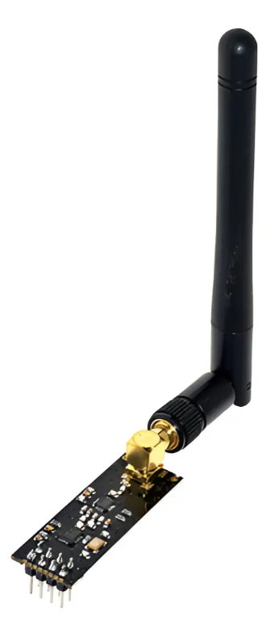 |
| CC1101 |  |
| Antenna |  |
| M5Stack IR Unit |  |
| IR Unit view 2 |  |
| Buttons | 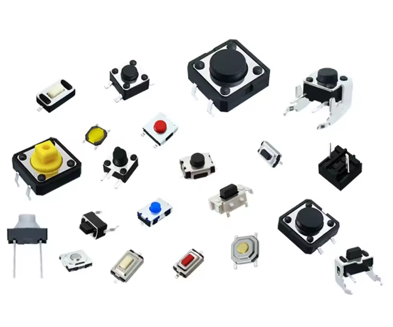 |
| Battery | 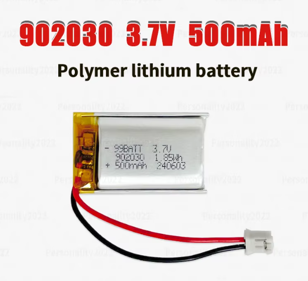 |
| TP4056 | 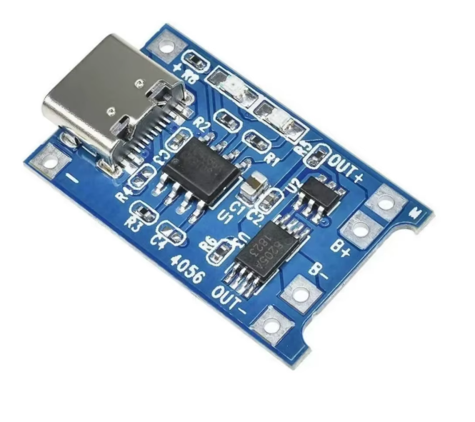 |
| Step-up |  |
| Switch | 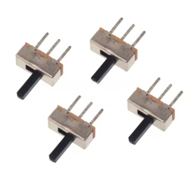 |
| PCB Board / mounting | 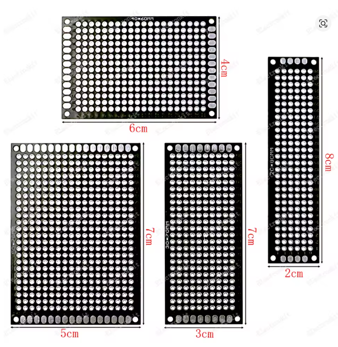 |

### Complete connection diagrams

These diagrams show wiring by blocks to make it easier to solder and review the setup without cluttering a single image.

#### TFT Screen and buttons

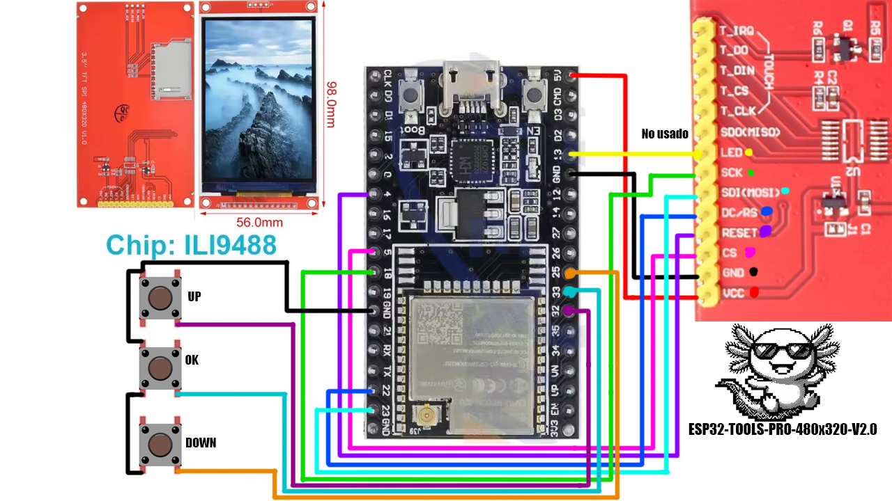

#### nRF24L01 Modules


#### CC1101 and IR Remote

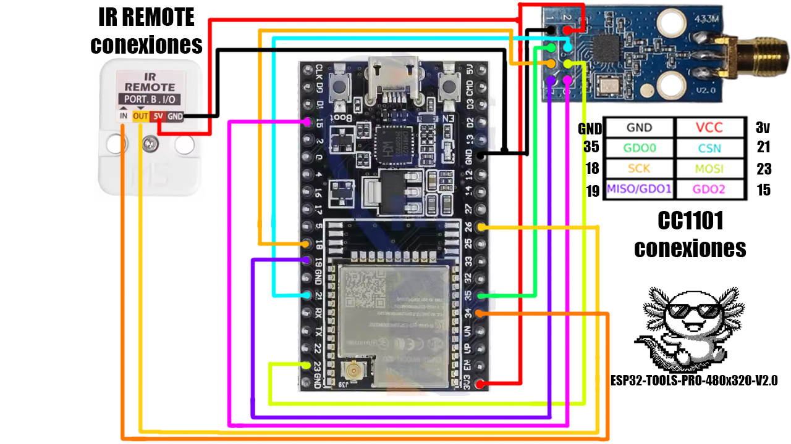

### Reference pinouts

| Module | Pinout |
| --- | --- |
| nRF24L01 PA + LNA | 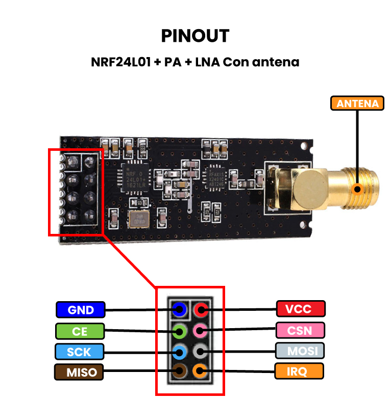 |
| CC1101 | 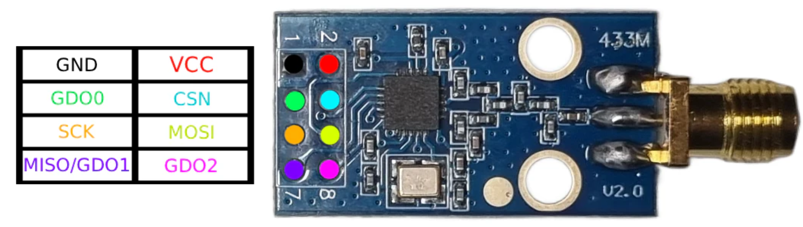 |

[Back to index](#index)

## Connections table

All modules must share `GND` with the ESP32. Do not connect any 3.3V module to 5V.

### Shared SPI bus

| Signal | ESP32 GPIO | Used by |
| --- | ---: | --- |
| SCK | GPIO18 | TFT, nRF24 #1, nRF24 #2, CC1101 |
| MOSI | GPIO23 | TFT, nRF24 #1, nRF24 #2, CC1101 |
| MISO | GPIO19 | nRF24 #1, nRF24 #2, CC1101 |

Each SPI module has its own `CS/CSN` pin, which is why they can share SCK/MOSI/MISO.

### 480x320 TFT Screen

| TFT Pin | ESP32 GPIO | Note |
| --- | ---: | --- |
| CS | GPIO5 | TFT chip select |
| RST | GPIO4 | TFT reset |
| DC / RS | GPIO22 | Data/Command |
| LED / BL | GPIO13 | Backlight |
| SCK / CLK | GPIO18 | Shared SPI |
| MOSI / SDI | GPIO23 | Shared SPI |
| MISO / SDO | Not used by TFT | Firmware defines TFT MISO as `-1` |
| VCC | Depends on module | Check your screen: some accept 5V, others 3.3V |
| GND | GND | Common ground |

### nRF24L01 #1

| nRF24 Pin | ESP32 GPIO | Note |
| --- | ---: | --- |
| CE | GPIO27 | Radio #1 control |
| CSN | GPIO14 | Radio #1 chip select |
| SCK | GPIO18 | Shared SPI |
| MOSI | GPIO23 | Shared SPI |
| MISO | GPIO19 | Shared SPI |
| VCC | 3.3V | Do not use 5V |
| GND | GND | Common ground |

### nRF24L01 #2

| nRF24 Pin | ESP32 GPIO | Note |
| --- | ---: | --- |
| CE | GPIO17 | Radio #2 control |
| CSN | GPIO16 | Radio #2 chip select |
| SCK | GPIO18 | Shared SPI |
| MOSI | GPIO23 | Shared SPI |
| MISO | GPIO19 | Shared SPI |
| VCC | 3.3V | Do not use 5V |
| GND | GND | Common ground |

### M5Stack IR Unit

| IR Module Pin | ESP32 GPIO | Function in firmware | Note |
| --- | ---: | --- | --- |
| OUT | GPIO26 | `IR_TX_PIN` | ESP32 output to module IR transmitter |
| IN | GPIO34 | `IR_RX_PIN` | ESP32 input from module IR receiver |
| 5V | 5V | Power | The M5Stack IR module runs on 5V |
| GND | GND | Common ground | Mandatory to share ground |

GPIO34 is input-only, which is why it's used for IR receiving. GPIO26 is used to transmit.

### CC1101

| CC1101 Pin | ESP32 GPIO | Function in firmware | Note |
| --- | ---: | --- | --- |
| CSN / CS | GPIO21 | `CC1101_CSN_PIN` | CC1101 chip select |
| SCK | GPIO18 | Shared SPI | SPI clock |
| MOSI / SI | GPIO23 | Shared SPI | ESP32 data to CC1101 |
| MISO / SO | GPIO19 | Shared SPI | CC1101 data to ESP32 |
| GDO0 | GPIO35 | `CC1101_GDO0_PIN` | RX input/RF edges |
| Extra GDO2 | GPIO15 | `CC1101_TX_DATA_PIN` | Optional jumper for `Lab Replay` |
| VCC | 3.3V | Power | Do not use 5V |
| GND | GND | Common ground | Mandatory to share ground |

The `GDO0 extra -> GPIO15` jumper is only necessary for `Lab Replay` testing. You can leave it out if you will only use diagnostics, monitor, finder, analyzer, and raw view.

### Buttons

| Button | ESP32 GPIO | Wiring |
| --- | ---: | --- |
| UP | GPIO32 | Button between GPIO32 and GND |
| OK | GPIO33 | Button between GPIO33 and GND |
| DOWN | GPIO25 | Button between GPIO25 and GND |

The buttons use internal pull-up. Pressing them pulls the pin `LOW`.

[Back to index](#index)

## Visual connection diagram

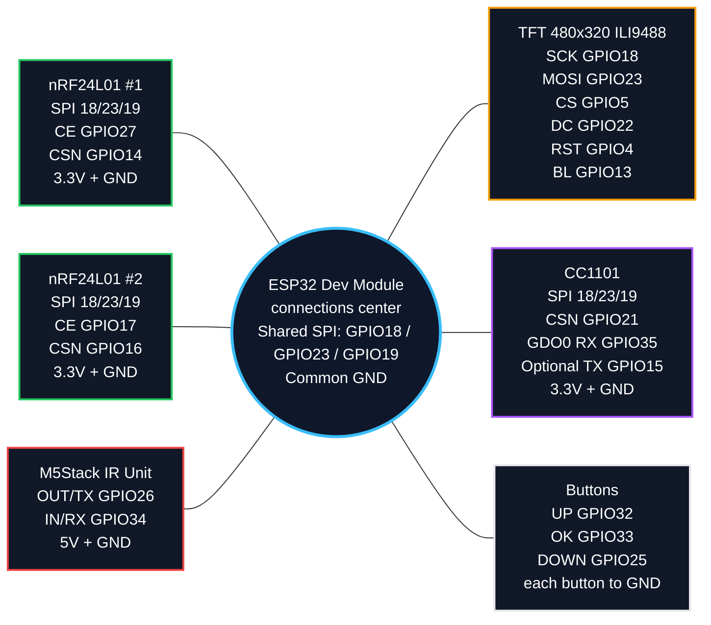

[Back to index](#index)

## Quick pin map

```text
ESP32 GPIO18  -> Shared SPI SCK
ESP32 GPIO23  -> Shared SPI MOSI
ESP32 GPIO19  -> Shared SPI MISO

ESP32 GPIO5   -> TFT CS
ESP32 GPIO4   -> TFT RST
ESP32 GPIO22  -> TFT DC
ESP32 GPIO13  -> TFT Backlight

ESP32 GPIO27  -> nRF24 #1 CE
ESP32 GPIO14  -> nRF24 #1 CSN
ESP32 GPIO17  -> nRF24 #2 CE
ESP32 GPIO16  -> nRF24 #2 CSN

ESP32 GPIO26  -> IR OUT / TX
ESP32 GPIO34  -> IR IN / RX

ESP32 GPIO21  -> CC1101 CSN
ESP32 GPIO35  -> CC1101 GDO0 RX
ESP32 GPIO15  -> CC1101 Optional GDO0 TX for Lab Replay

ESP32 GPIO32  -> UP Button to GND
ESP32 GPIO33  -> OK Button to GND
ESP32 GPIO25  -> DOWN Button to GND
```

[Back to index](#index)

## Web flasher

Direct flashing from browser:

[https://pepeangell5.github.io/ESP32-TOOLS-PRO-480x320-V2.0/](https://pepeangell5.github.io/ESP32-TOOLS-PRO-480x320-V2.0/)

The page uses ESP Web Tools and these repo files:

- `index.html`: flashing page with ESP Web Tools.
- `manifest.json`: manifest used by ESP Web Tools.
- `assets/Firmware/firmware-merged.bin`: full binary to flash from offset `0x0`.
- `assets/Firmware/firmware.bin`: compiled application.
- `assets/Firmware/bootloader.bin`: bootloader.
- `assets/Firmware/partitions.bin`: partitions table.

Target repo:

```text
https://github.com/pepeangell5/ESP32-TOOLS-PRO-480x320-V2.0
```

[Back to index](#index)

## Compile and upload with PlatformIO

Compile:

```bash
pio run
```

Upload to ESP32:

```bash
pio run -t upload --upload-port COM3
```

If the upload fails with a boot/serial error, hold down `BOOT` when starting the upload and release it when PlatformIO begins to write.

[Back to index](#index)

## Known limits

- WiFi is only 2.4 GHz because the classic ESP32 lacks a 5 GHz radio.
- The CC1101 gives approximate RSSI/frequency readings; it's not a professional spectrum analyzer.
- `IR Proximity` is experimental and might stay at `NONE` depending on angle and physical bounce.
- Air conditioners usually use long signals with full states; save each function separately.
- `Jammer`, `BT Jammer`, `BLE Spam`, `BT Disruptor`, `Deauther`, `KARMA` and `Beacon Spam` are lab functions. They can degrade nearby communications and must be used only with authorization.
- `Lab Replay` RF is intended for light bulbs, smart plugs, or personal fixed-code devices. It is not for vehicles, alarms, locks, or gates.
- RF433T/RF433R modules are left out of V2.0.

[Back to index](#index)

## Credits

Project created and tested by PepeAngell for ESP32-TOOLS-PRO-480x320-V2.0.

[Back to index](#index)

## Social media and links

- GitHub: [github.com/pepeangell5](https://github.com/pepeangell5)
- Web Flasher: [pepeangell5.github.io/ESP32-TOOLS-PRO-480x320-V2.0](https://pepeangell5.github.io/ESP32-TOOLS-PRO-480x320-V2.0/)
- Instagram: [@pepeangelll](https://instagram.com/pepeangelll)
- Facebook: [ESP32Tools](https://www.facebook.com/esp32tools/)

[Back to index](#index)

[Back to top](#esp32-tools-pro-480x320-v20)
